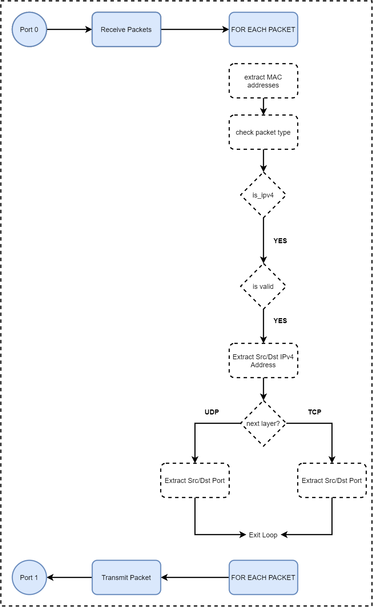

# DPDK-Learning

## Learn To Receive, Parse and Transmit

- Based on ferruhy's repository "[dpdk-simple-app](https://github.com/ferruhy/dpdk-simple-app)"
- Expanded by parsing the followine headers
  -  Ethernet
      -  Source MAC Address
      -  Destination MAC Address
  -  Network 
      -  Source IPv4 Address
      -  Destination IPv4 Address
  -  Transport Layer   
      -  Source Port
      -  Destination Port
-  Follow Along [here](https://ibrahimshahzad.github.io/blog) 
   -  [Setting up DPDK](https://ibrahimshahzad.github.io/blog/Writing_your_first_dpdk_app/)
   -  [Receive and Transmit Packets](https://ibrahimshahzad.github.io/blog/dpdk_02/)
   -  [Parse the packet headers](https://ibrahimshahzad.github.io/blog/dpdk_03/) 

## Whats happening inside

  


  
## Requirements

- A linux based system:
  - 2 Intel processors, each with 8 cores, 8 GB RAM
  - 2 DPDK compatible NIC(s) with traffic on atleast one
- Some knowledge of C

## How to run

First,
- make sure you have DPDK installed
- make sure `hugepages` are setup. ([help!](https://ibrahimshahzad.github.io/blog/Writing_your_first_dpdk_app/))
- make sure NIC(s) are binded to `igb_uio` driver.  ([help!](https://ibrahimshahzad.github.io/blog/Writing_your_first_dpdk_app/))

Now
- Clone this repo
```sh
git clone https://github.com/IbrahimShahzad/dpdk-learning.git
cd dpdk-learning
```
- compile the code
```sh
make
```
- Run the following command to get started
```sh
./build/my_app -l 0-3 -n 3 -- -p 0x3
```

> If you are having trouble, see [here](https://ibrahimshahzad.github.io/blog/Writing_your_first_dpdk_app/)
